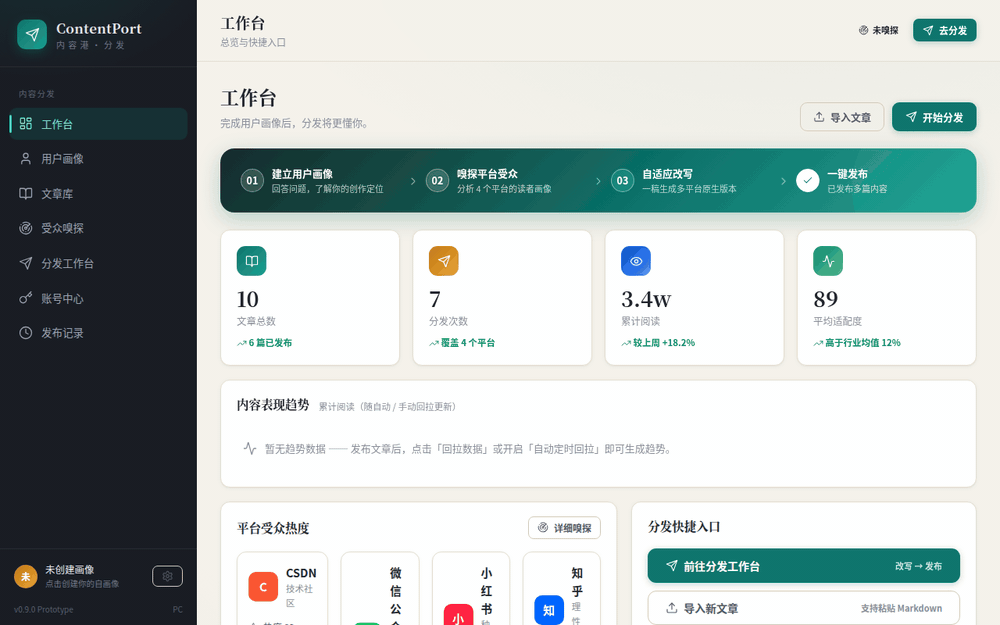
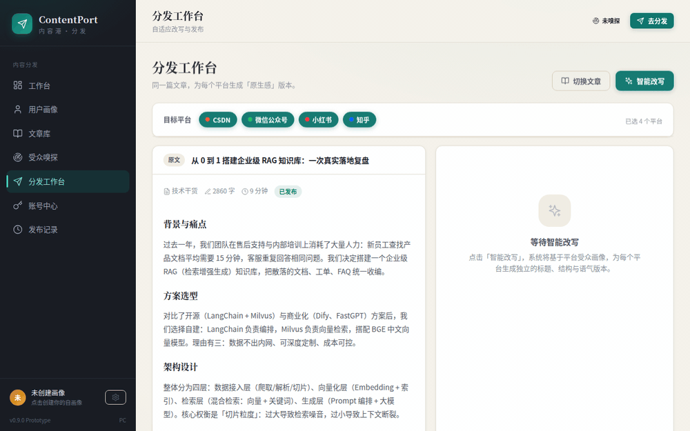
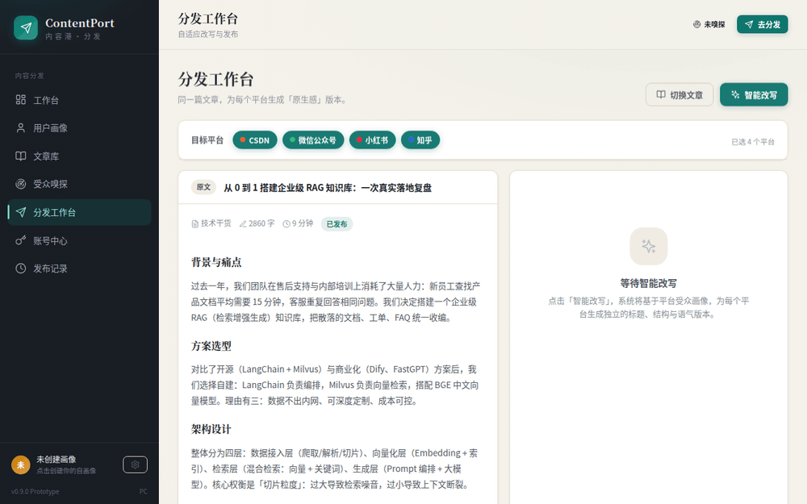

# ContentPort · 内容港

> 一篇文章，分发到 CSDN / 微信公众号 / 小红书 / 知乎 —— 不是简单的搬运，而是为每个平台的读者"量身改写"，让内容看起来就像平台原生的。

ContentPort（内容港）是一款 PC 桌面应用（Electron）。你只需把写好的一篇文章放进文章库，它会：

1. **嗅探** 四个平台的读者画像（年龄段、阅读习惯、内容偏好）
2. 基于你的 **用户画像** 和平台受众，为每个平台 **自动改写** 出独立的标题、结构与语气版本
3. 一键 **真实发布** 到四个平台（无需复制粘贴）
4. 发布后 **自动回拉** 阅读 / 点赞 / 评论数据，形成趋势曲线
5. 支持 **定时排队发布**，到点自动发出

---

## ✨ 功能特性

| 能力 | 说明 |
| --- | --- |
| 🎯 受众自适应改写 | 用户画像 + 平台受众嗅探 → 为 CSDN/微信/小红书/知乎 各生成"原生感"版本；可接入 AI（OpenAI 兼容 / 默认 DeepSeek），失败自动回退本地规则引擎 |
| 📡 四平台真实发布 | CSDN（MetaWeblog 接口）、微信公众号（官方 API，含封面图上传）、知乎（扫码登录 + 网页接口）、小红书（扫码登录 + 浏览器全自动发布） |
| 📊 数据回拉 | 阅读 / 点赞 / 评论数据回拉：单条 / 批量一键回拉 / 按设定间隔自动定时回拉 |
| 📈 数据趋势图表 | 工作台累计阅读曲线 + 单篇文章阅读/点赞/评论折线（纯 SVG 渲染，无需联网） |
| ⏰ 定时排队发布 | 设定未来时间 → 入队 → 到点自动调用真实发布接口，队列可随时取消 |
| 📚 文章库 | 正文编辑、标签、多分类筛选、拖拽排序、Markdown 复制稿导出 |
| 👤 用户画像 | 问答式自画像，让改写更懂你的创作定位 |

---

## 🎬 使用说明

### 1. 应用概览

点击侧边栏可切换七个核心页面：工作台、用户画像、文章库、受众嗅探、分发工作台、账号中心、发布记录。



### 2. 智能改写：一稿 → 多平台原生版本

在「分发工作台」选择目标平台后点击「智能改写」，系统会为每个平台独立生成标题、结构与语气版本，并给出适配度评分与调整清单；可在平台标签间切换对比。



### 3. 发布文章（立即 / 定时）

改写完成后点击「一键发布」，选择立即发布或定时发布。绑定平台账号后走真实 API 自动发布；未绑定账号时生成排版好的「复制稿」供手动粘贴，两种方式都不会丢内容。



---

## 🚀 快速开始

### 下载安装包（推荐）

到 [GitHub Releases](https://github.com/mw2wbyys6t-sudo/post-tailor/releases) 下载最新版本：

- `ContentPort-Win-x64-*.zip`：**Windows 便携版**（解压即用，无需安装）
- `ContentPort-Linux-x64-*.zip`：**Linux 便携版**

### 从源码运行

```bash
cd contentport
npm install
npm start          # 启动桌面应用
npm run dev        # 开发模式
npm run dist       # 打包当前平台安装包
```

---

## 📖 使用指南

### 第一步：建立用户画像（可选但推荐）

进入「用户画像」页回答问题（创作领域、目标读者、内容风格等），改写引擎会据此调整措辞与深度。

### 第二步：接入 AI（可选）

右上角 ⚙ 设置中填写 OpenAI 兼容接口：

- **Base URL**：如 `https://api.deepseek.com`
- **API Key**：你的密钥（仅保存在本机）
- **模型**：如 `deepseek-chat`

未配置 AI 时，改写会自动回退到内置规则引擎，功能依然可用。

### 第三步：绑定平台账号

进入「账号中心」按平台登录：

| 平台 | 登录方式 | 发布通道 |
| --- | --- | --- |
| CSDN | 用户名 + 密码 | MetaWeblog 接口直发 |
| 微信公众号 | AppID + AppSecret | 官方素材/发布 API |
| 知乎 | 扫码登录 | 登录态 + 网页内部接口直发 |
| 小红书 | 扫码登录 | 浏览器全自动发布（复用登录态自动操作官方发布页，失败自动回退手动确认） |

### 第四步：导入文章并分发

1. 「文章库」→ 导入文章（支持 Markdown）
2. 「分发工作台」→ 选择目标平台 → **智能改写**
3. 逐平台对照预览，满意后 **一键发布**（或选定时发布入队）

### 第五步：看数据

「发布记录」页可对每条记录回拉阅读/点赞/评论；开启「设置 → 数据自动回拉」后，应用会按设定间隔自动更新数据，并在工作台绘制累计阅读趋势曲线。

---

## 🛠 技术栈

- **桌面壳**：Electron 33（主进程代理 AI 与平台 API 请求，凭据不出本机）
- **前端**：原生 HTML / CSS / JavaScript（零框架，SPA + hash 路由）
- **图表**：纯 SVG 手绘折线图（无第三方图表库）
- **平台通道**：`electron/platform/` 下四个独立模块，统一 `verifyLogin / publish / fetchStats` 接口

## 📁 目录结构

```
contentport/
├── electron/
│   ├── main.js              # 主进程：IPC 代理、扫码登录、定时调度、小红书自动发布
│   └── platform/
│       ├── csdn.js          # CSDN MetaWeblog 通道
│       ├── wechat.js        # 微信公众号官方 API 通道
│       ├── zhihu.js         # 知乎网页接口通道
│       └── xhs.js           # 小红书登录态校验通道
├── js/
│   ├── mock.js              # 平台画像 / 文章 / 数据
│   ├── state.js             # 本地状态与持久化
│   ├── api.js               # 业务 API（改写 / 发布 / 回拉）
│   ├── rewrite.js           # 规则引擎改写
│   ├── ui.js                # UI 工具（图标 / 弹窗 / 图表）
│   └── pages/               # 七个页面
├── docs/demo/               # 使用说明 GIF
└── index.html / styles.css
```

## ⚠️ 说明

- 小红书无第三方开放发布 API，本应用采用"浏览器全自动发布"（复用扫码登录态操作官方发布页），比逆向签名更稳定、封号风险更低；若平台页面改版导致自动化失败，会自动回退为手动确认，正文已放剪贴板，不会丢内容。
- 各平台接口与页面结构可能随平台方调整而变化，若遇到发布异常请升级到最新版本。

## 📄 License

[MIT](LICENSE)
